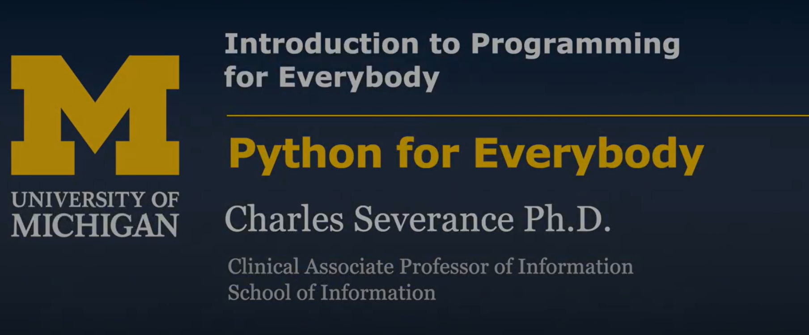
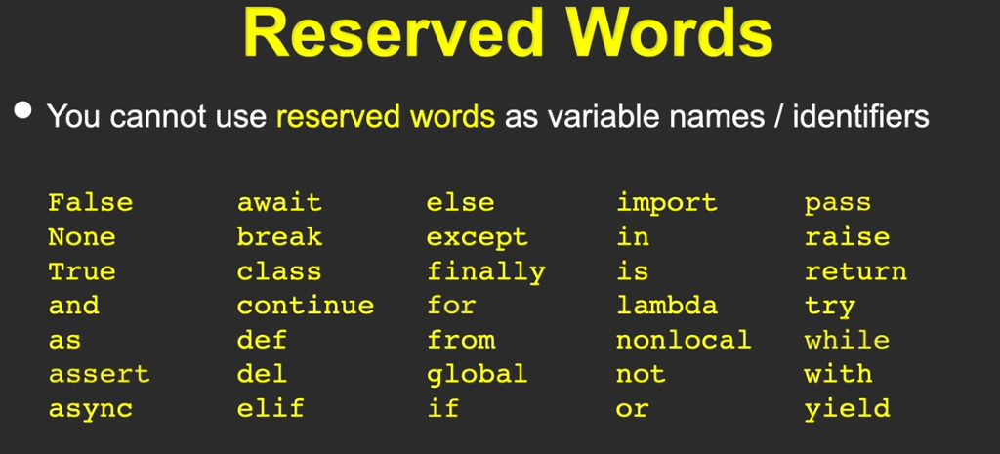

# Python-learning-with-coursera
Learning Python with coursera course "Python for everybody".

Fundamentals of programing with Python with the instructor Charles Severance.

In Introduction-1 
video instructor presents fundamental concepts of programming using Python, emphasizing the importance of becoming a creator of the technology rather than just a consumer.

Introduction-2
This lecture focuses on the fundamental concepts of hardware architecture, providing definitions and an overview of key components in a computer system.

Input/Output Devices

Input/output devices allow interaction between the computer and the outside world, including peripherals like keyboards and screens.
These devices are essential for user interaction and data exchange.

Central Processing Unit (CPU) and Memory

The CPU is the brain of the computer, executing instructions at high speeds (up to three billion instructions per second).
Main memory temporarily holds data and programs while secondary memory provides permanent storage, ensuring data is retained even when the computer is off.

Introduction-3
significance in the world of programming.

Introduction to Python

Python is a programming language created by Guido van Rossum over 20 years ago, designed to be both powerful and enjoyable to use.
The name "Python" is inspired by Monty Python's Flying Circus, reflecting a playful approach to programming.

Learning Python

As beginners, learners will encounter "syntax errors," which indicate that Python does not understand the code, not a judgment of their abilities.
The journey of learning Python may be frustrating at times, but persistence will lead to understanding and mastery.

Community and Culture

Those who learn Python often refer to themselves as "Pythonistas," fostering a sense of community among learners.
The lecture encourages learners to embrace mistakes as part of the learning process and to trust in their ability to grasp the language over time.

Next module focuses on introducing learners to programming with Python and the tools available for writing and testing code.

Installing and Using Python

Learners are encouraged to install Python on their devices to write programs effectively.
For those unable to install Python, a web-based Python Playground is provided for coding practice.

Python Playground Features

The Playground allows users to write and run code without grading, offering a space for experimentation.
It includes a feature for teaching staff to view and assist with student code, enhancing support and communication.

Best Practices for Learning Python

While the Playground is useful, learners are advised to develop skills on their own devices for a more comprehensive learning experience.
The course emphasizes the importance of practicing coding in a local environment when possible.

DAY 2

Video 1:

This course content introduces the basics of the Python programming language and how to interact with it.

Getting Started with Python

Python can be started on various operating systems through a command line interface, allowing users to input commands interactively.
The first command often involves an assignment statement, such as X = 1, which stores a value in memory.

Understanding Variables and Expressions

An assignment statement assigns a value to a variable, while the print function retrieves and displays that value.
Expressions can manipulate variables, such as adding one to X and updating its value.
Programming Structure and Syntax

Python has reserved words that have specific meanings, which cannot be used as variable names.

Writing a program involves creating lines of code that form sentences, which can be combined into paragraphs, ultimately creating a script or program file.

Video 2:

The course content focuses on the fundamental programming concepts in Python, particularly the patterns used in constructing programs.

Sequential Steps

The most basic programming pattern is sequential, where instructions are executed one after another.
An example is provided with a simple Python program that assigns a value to a variable and prints it.

Conditional Steps

Conditional programming allows for decision-making in code using "if" statements to execute certain actions based on conditions.
A flowchart illustrates how the program evaluates conditions and executes corresponding statements.

Looping and Iteration

The repeat pattern, using loops like "while" and "for," enables the execution of code multiple times until a condition is met.
The importance of iteration variables is highlighted to prevent infinite loops, ensuring the loop runs a defined number of times.
This overview sets the stage for deeper exploration of programming concepts in subsequent chapters.

Day 3

Video 1:

The content focuses on the first assignment of the course, which involves writing a simple "Hello World" program in Python.

Assignment Overview

The assignment requires students to print "Hello World" using Python.
Students will use an autograder to check their code and receive feedback.

Using the Autograder

The autograder allows students to submit their code and see if it runs correctly.
It provides feedback on errors, such as syntax errors or output mismatches.

Grading System

The grading is pass/fail, with students receiving either 100% or 0%.
Once a grade is set, students can experiment with their code without affecting their score.
Static Analysis

The autograder performs static analysis to ensure code quality, checking for proper use of programming constructs.
Students are encouraged to understand the assignments rather than copying code from others.

Support and Communication

Students can communicate with teaching assistants for help without posting code in forums.
This approach aims to promote learning and understanding of the material.

Video 2:

This course content focuses on the foundational elements of Python programming, specifically covering constants, variables, and reserved words.

Constants and Their Types

Constants are fixed values that do not change, such as numbers (e.g., integers and floating-point) and string constants (e.g., "hello world").
String constants allow programs to communicate with users, providing a way to display messages.

Reserved Words and Their Importance

Reserved words are specific keywords in Python that have predefined meanings (e.g., class, del, else) and should not be used as variable names.
Understanding these words is crucial to avoid conflicts and ensure proper code functionality.

Variables and Assignment Statements

Variables are user-defined names that represent memory locations where data can be stored and manipulated.
Assignment statements in Python allocate memory for variables and can overwrite existing values, following specific naming rules (e.g., starting with letters or underscores).

Video 3:

The content focuses on the importance of variable naming in Python programming and how it affects code readability for humans versus the Python interpreter.

Variable Naming

Choosing sensible variable names is crucial for code clarity, even though Python does not require mnemonic names.
Consistent naming within a program is more important than the specific names chosen.

Human vs. Python Understanding

Python treats all variable names equally, regardless of their meaning, which can lead to confusion for human readers.
Using clear and descriptive names helps others understand the code's purpose and logic.

Assignment Statements

Assignment in programming differs from mathematical equality; it involves storing computed values in variables.
The process allows for expressions like x = x + 1, which is common in programming but nonsensical in mathematics.
